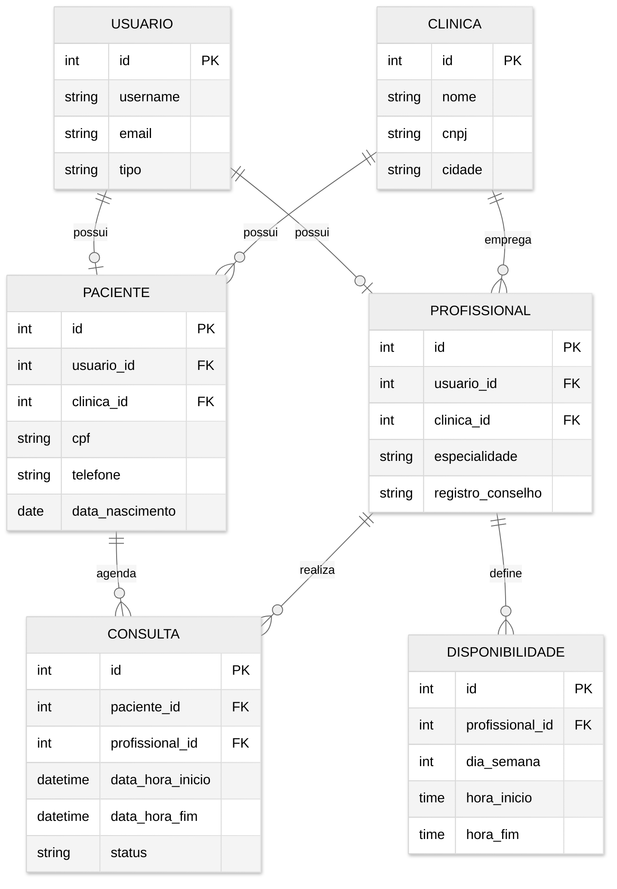

## Estrutura atual do Banco

```mermaid
---
config:
  look: neo
  theme: neutral
---
erDiagram
    USUARIO {
        int id PK
        string username
        string email
        string tipo
    }

    CLINICA {
        int id PK
        string nome
        string cnpj
        string cidade
    }

    PACIENTE {
        int id PK
        int usuario_id FK
        int clinica_id FK
        string cpf
        string telefone
        date data_nascimento
    }

    PROFISSIONAL {
        int id PK
        int usuario_id FK
        int clinica_id FK
        string especialidade
        string registro_conselho
    }

    DISPONIBILIDADE {
        int id PK
        int profissional_id FK
        int dia_semana
        time hora_inicio
        time hora_fim
    }

    CONSULTA {
        int id PK
        int paciente_id FK
        int profissional_id FK
        datetime data_hora_inicio
        datetime data_hora_fim
        string status
    }

    USUARIO ||--o| PACIENTE : "possui"
    USUARIO ||--o| PROFISSIONAL : "possui"
    CLINICA ||--o{ PACIENTE : "possui"
    CLINICA ||--o{ PROFISSIONAL : "emprega"
    PROFISSIONAL ||--o{ DISPONIBILIDADE : "define"
    PACIENTE ||--o{ CONSULTA : "agenda"
    PROFISSIONAL ||--o{ CONSULTA : "realiza"

```